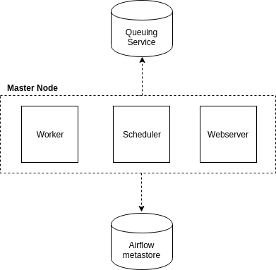
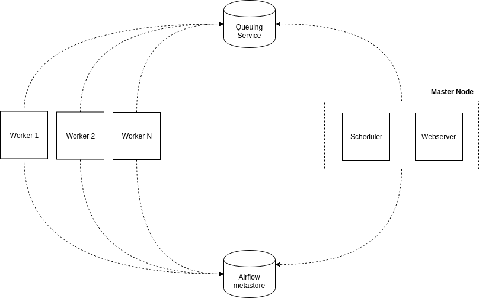

# Scheduler

- executes tasks on array of workers
- is a platform to programmatically author, schedule and monitor workflows.
- Use airflow to author workflows as directed acyclic graphs (DAGs) of tasks.
- When workflows are defined as code (Python), they become more maintainable, versionable, testable, and collaborative.

# Principles

1. dynamic
	- pipelines configured as code in Python so pipeline generation is possible
2. extensible
	- can define your operators/executors and extend library 
3. elegant :)
	- lean, explicit, pipeline parameters are included in airflow core via jinja templating engine
4. scalable
	- modular architecture
	- uses queue to orchestrate arbitrary number of workers
	- ready to scale to infinity

# Architecture

1. web server 
	- daemon that accepts http requests and allow to interact with airflow via python/flaskweb app
	- pause, unpause dags, manually trigger dags, view running dags, restart failed DAGs
1. Scheduler
	- daemon which periodically polls to determine if any registered DAG and/or Task Instances needs to triggered based off its schedule.
1. Executors / Workers
	- daemon that handles starting up and managing 1 to many CeleryD (Celery Distributed Task Queue deamon) processes to execute the desired tasks of a particular DAG.

## Additional:

1. Metadata Database: 
	- Airflow uses a SQL database to store metadata about the data pipelines being run. 
	- Postgres, MySQL supported, SQLite for dev purposes only
1. The Executor 
	- in reality it is NOT a separate process, but run within the Scheduler.
1. The Worker(s) 
	- are separate processes which also interact with the other components of the Airflow architecture and the metadata repository.
1. airflow.cfg 
	- is the Airflow configuration file which is accessed by the Web Server, Scheduler, and Workers.
1. DAGs 
	- refers to the DAG files containing Python code, representing the data pipelines to be run by Airflow. 
	- The location of these files is specified in the Airflow configuration file, but they need to be accessible by the Web Server, Scheduler, and Workers.

## Single node setup



- all the services on a single node
- Scheduler periodically polls to see if any DAGs that are registered in the MetaStore need to be executed. 
- If a particular DAG needs to be triggered (based off the DAGs Schedule), then Scheduler Daemon creates a DagRun instance in the MetaStore and starts to trigger the individual tasks in the DAG. 
- The scheduler will do this by pushing messages into the Queueing Service. 
- Each message contains information about the Task it is executing including the DAG Id, Task Id and what function needs to be performed. 
- In the case where the Task is a BashOperator with some bash code, the message will contain this bash code.
- A user might also interact with the Web Server and manually trigger DAGs to be ran. 
- When a user does this, a DagRun will be created and the scheduler will start to trigger individual Tasks in the DAG.
- The celeryD processes controlled by the Worker daemon, will pull from the Queueing Service on regular intervals to see if there are any tasks that need to be executed. 
- When one of the celeryD processes pulls a Task message, it updates the Task instance in the MetaStore to a Running state and tries to execute the code provided. 
- If it succeeds then it updates the state as succeeded but if the code fails while being executed then it updates the Task as failed.

## Cluster (multi-node) setup



A more formal setup for Apache Airflow is to distribute the daemons across multiple machines as a cluster.

###Benefits
1. Higher Availability
	- If one of the worker nodes were to go down or be purposely taken offline, the cluster would still be operational and tasks would still be executed.
2. Distributed Processing
	- If you have a workflow with several memory intensive tasks, then the tasks will be better distributed to allow for higher utilization of data across the cluster and provide faster execution of the tasks.
1. Scaling Workers
	- Horizontally
		- You can scale the cluster horizontally and distribute the processing by adding more executor nodes to the cluster and allowing those new nodes to take load off the existing nodes. 
		- Since workers don’t need to register with any central authority to start processing tasks, the machine can be turned on and off without any downtime to the cluster.
	- Vertically
		- You can scale the cluster vertically by increasing the number of celeryD daemons running on each node. 

###Scaling master nodes

- You can also add more Master Nodes to your cluster to scale out the services that are running on the Master Nodes. 
- This will allow to scale out the Web Server Daemon in case there are too many HTTP requests coming for one machine to handle or if you want to provide Higher Availability for that service.
- there can only be one Scheduler instance running at a time. 
- If you have multiple Schedulers running, there is a possibility that multiple instances of a single task will be scheduled. 
- This could cause some major problems with your Workflow and cause duplicate data to show up in the final table if you were running some sort of ETL process.
- Scheduler daemon may also be setup to run on its own dedicated Master Node.

# Concepts

##DAG 
Directed Acyclic Graph is a collection of all the tasks you want to run, organized in a way that reflects their relationships and dependencies.

##Scope
Airflow will load any DAG object it can import from a DAG file. Critically, that means the DAG must appear in globals(). 

##Default Arguments
If a dictionary of default_args is passed to a DAG, it will apply them to any of its operators. This makes it easy to apply a common parameter to many operators without having to type it many times.

##Context manager

A DAG object can be instantiated and referenced in tasks in two ways:

1. explicity pass DAG reference:
```
dag = DAG(...)
t1 = DummyOperator(task_id="task1", dag=dag)
t2 = DummyOperator(task_id="task2", dag=dag)
```
1. use DAG in context manager, no need to reference the DAG object:
```
with DAG(...) as dag:
    t1 = DummyOperator(task_id="task1")
    t2 = DummyOperator(task_id="task2")
```
context manager is implemented by setting the DAG to a global variable `_CONTEXT_MANAGER_DAG`. Operators simply check for the existence of `_CONTEXT_MANAGER_DAG` and if so, set `dag=_CONTEXT_MANAGER_DAG`. Therefore, we don't even have to write `as dag` (unless you'd like to reference it somewhere in your code):
```
with DAG(...):
    t1 = DummyOperator(task_id="task1")
    t2 = DummyOperator(task_id="task2")
```
The DAG context manager appears to work "magically" without having to reference it in any task.

##Operators
Airflow provides operators for many common tasks, including:

- BashOperator - executes a bash command
- PythonOperator - calls an arbitrary Python function
- EmailOperator - sends an email
- HTTPOperator - sends an HTTP request
- MySqlOperator, SqliteOperator, PostgresOperator, MsSqlOperator, OracleOperator, JdbcOperator, etc. - executes a SQL command
- Sensor - waits for a certain time, file, database row, S3 key, etc…

In addition to these basic building blocks, there are many more specific operators: DockerOperator, HiveOperator, S3FileTransferOperator, PrestoToMysqlOperator, SlackOperator

##DAG Assignment
- Operators do not have to be assigned to DAGs immediately (previously dag was a required argument). 
- However, once an operator is assigned to a DAG, it can not be transferred or unassigned. 
- DAG assignment can be done explicitly when the operator is created, through deferred assignment, or even inferred from other operators.

##Tasks
- Once an operator is instantiated, it is referred to as a "task". 
- The instantiation defines specific values when calling the abstract operator, and the parameterized task becomes a node in a DAG.

##Task Instances
- A task instance represents a specific run of a task and is characterized as the combination of a dag, a task, and a point in time. 
- Task instances also have an indicative state, which could be “running”, “success”, “failed”, “skipped”, “up for retry”, etc.

##Workflows
By combining DAGs and Operators to create TaskInstances, you can build complex workflows		

#Pipeline definition

```python
from airflow.operators.bash_operator import BashOperator
from airflow import DAG
from datetime import datetime, timedelta

import os
import sys

os.environ['SPARK_HOME'] = '/opt/spark'
sys.path.append(os.path.join(os.environ['SPARK_HOME'], 'bin'))

JAR_PATH = '/home/varvara/AirflowSmallProject-assembly-0.1.jar'

default_args = {
    'depends_on_past': False,
    'email_on_failure': False,
    'email_on_retry': False,
}

dag = DAG(
    'airflow_small_project',
    catchup=False,
    default_args=default_args,
    description='A simple 201 homework DAG',
    schedule_interval=None,
    start_date=datetime(2020, 12, 22)
)

spark_task = BashOperator(
    task_id='spark_avro',
    bash_command='spark-submit --packages {{params.avro}} --class {{ params.class }} {{ params.jar }}',
    params={
    'avro': 'org.apache.spark:spark-avro_2.11:2.4.6',
    'class': 'Main', 
    'jar': JAR_PATH
    },
    dag=dag
)

spark_task
```

1. Importing Modules: An Airflow pipeline is just a Python script that happens to define an Airflow DAG object. You can import libs you need.
1. Default Arguments: we have the choice to explicitly pass a set of arguments to each task’s constructor (which would become redundant), or (better!) we can define a dictionary of default parameters that we can use when creating tasks.
1. Instantiate a DAG: We’ll need a DAG object to nest our tasks into. Here we pass a string that defines the dag_id, which serves as a unique identifier for your DAG. We also pass the default argument dictionary that we just defined and define a schedule_interval of 1 day for the DAG.
1. Tasks: Tasks are generated when instantiating operator objects. An object instantiated from an operator is called a constructor. The first argument `task_id` acts as a unique identifier for the task.
1. Templating with Jinja: Airflow leverages the power of Jinja Templating and provides the pipeline author with a set of built-in parameters and macros. Airflow also provides hooks for the pipeline author to define their own parameters, macros and templates.
1. Setting up Dependencies: last line - rule to execute tasks - sequential, parallel, etc.

## Jinja в Airflow:


1. работа с датами. `{{ ds }}, {{ yesterday_ds }}, {{ tomorrow_ds }}` — после препроцессинга эти шаблоны заменяются датой запуска, днём до него и следующим днём в формате YYYY-MM-DD. То же самое, но только цифры, без дефисов: `{{ ds_nodash }}, {{ yesterday_ds_nodash }}, {{ tomorrow_ds_nodash }}`
1. Использование встроенных функций. Например, {{ macros.ds_add(ds, -5) }} — это способ отнять или добавить несколько дней; `{{ macros.ds_format(ds, “%Y-%m-%d”, “%Y”) }}` — форматирование даты.
1. Передача параметров. Они передаются в виде словаря в аргументе params, а получаются так: `{{ params.name_of_our_param }}`
1. Использование пользовательских функций, точно так же переданных в параметрах. `{{ params.some_func(ds) }}`
1. Использование встроенных библиотек Python:
```
{{ (macros.dateutil.relativedelta.relativedelta(day=1, months=-params.retention_shift)).strftime("%Y-%m-%d") }}
```
1. Использование конструкции if-else:
```
{{ dag_run.conf[“message”] if dag_run else “” }}
```
1. Организация циклов:
```

{{ macros.ds_add(ds, -idx) }}

```

# Airflow UI.

1. DAGs View - List of the DAGs in your environment, and a set of shortcuts to useful pages. You can see exactly how many tasks succeeded, failed, or are currently running at a glance.
1. Tree view - A tree representation of the DAG that spans across time. If a pipeline is late, you can quickly see where the different steps are and identify the blocking ones.
1. graph view - is perhaps the most comprehensive. Visualize your DAG’s dependencies and their current status for a specific run.
1. variable view - allows you to list, create, edit or delete the key-value pair of a variable used during jobs. Value of a variable will be hidden if the key contains any words in (‘password’, ‘secret’, ‘passwd’, ‘authorization’, ‘api_key’, ‘apikey’, ‘access_token’) by default, but can be configured to show in clear-text.
1. Gantt chart - lets you analyse task duration and overlap. You can quickly identify bottlenecks and where the bulk of the time is spent for specific DAG runs.
1. Task duration - The duration of your different tasks over the past N runs. This view lets you find outliers and quickly understand where the time is spent in your DAG over many runs.
1. Task instance context menu - From the pages above (tree view, graph view, gantt, …), it is always possible to click on a task instance, and get to this rich context menu that can take you to more detailed metadata, and perform some actions.