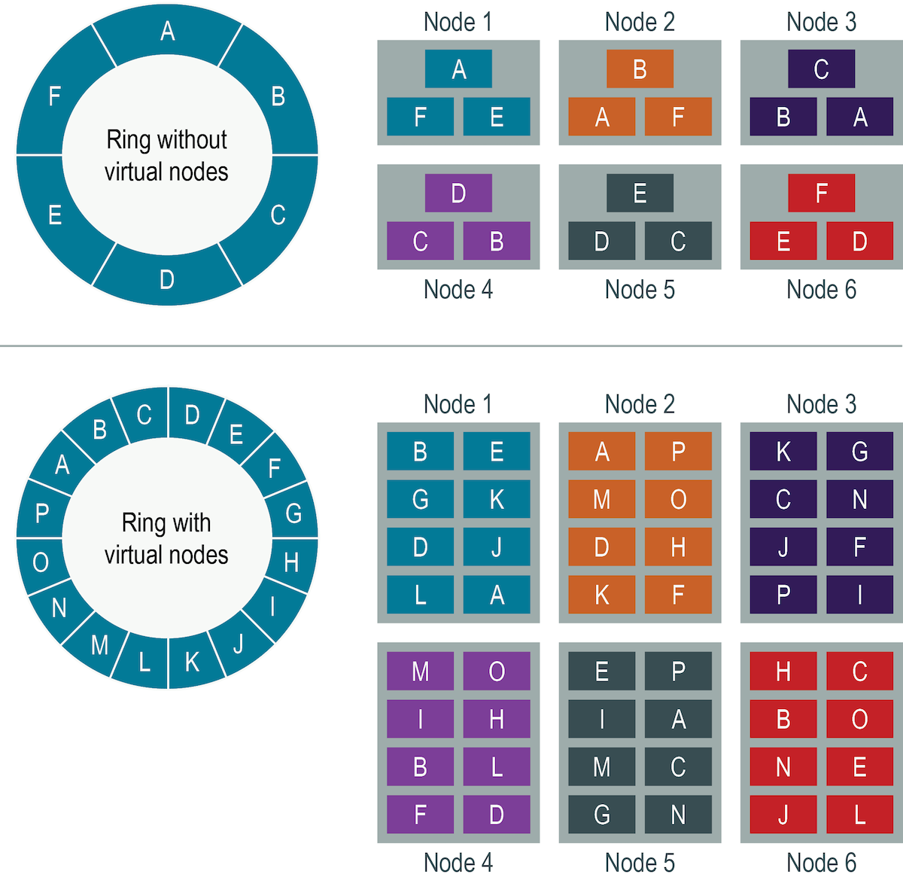

# Architecture

- linear scalability

- Node: one Cassandra instance
- Rack: a logical set of nodes
- Data Center: a logical set of racks
- Cluster: the full set of nodes which map to a single complete token ring 


## Data model
- Keyspace
	- The outermost grouping of data, similar to a schema in a relational database. 
	- All tables belong to a keyspace. 
	- A keyspace is the defining container for replication.
- Table
	- A table stores data based on a primary key, which consists of a partition key and optional clustering columns. Materialized views can also be added for high cardinality data.
	- A partition key defines the node on which the data is stored, and divides data into logical groups. Define partition keys that evenly distribute the data and also satisfy specific queries. Query and write requests across multiple partitions should be avoided if possible.
	- A clustering column defines the sort order of rows within a partition. When defining a clustering column, consider the purpose of the data. For example, retrieving the most recent transactions, sorted by date, in descending order.
	- Materialized views are tables built from another table's data with a new primary key and new properties. Queries are optimized by the primary key definition. Data in the materialized view is automatically updated by changes to the source table.

## Partitions

### Partition
- Table is a set of partitions
- is a collection of Rows that share the same Partition Key(s) that are ordered, within the Partition, by their Clustering Key(s).
- Partition may be single or multiple row
- Partition key uniquely identifies a partition, and may be simple or composite

### Partition Header
- contains the Partition Key
- contains deletion info for partition tombstones
- The Partition Key is the concatenated Columns of the Partition Key defined in your Table.
	- The length of the Partition Key is encoded using a short, giving it a max length of 65,535 bytes.
	- The concatenated bytes of the Partition Key columns are then written out.

### Row
- identified me primary key = partition key + clustering key
- static or non-static
- static row is written before the Clusterable objects.
- the only difference between a static and non-static Row on disk is the presence of a `ClusteringPrefix`.

### Clustering
- Column uniquely identifies a cell in a partition, and may be regular or clustering
- A `Row` is identified by the value of it's clustering columns which are stored in a `Clustering` object , and it associate a number of
cells to each of its non-PK non-static columns.


###Range Tombstone 
- are used to record deletions that are removing more than a single Cell. 
- For example when a `list<>` Column is overwritten all of the previous contents must be “deleted”.
- `RangeTombstoneMarker` is just one of the bound of the range tombstone (so that a range tombstone is composed of 2 "marker" in practice, its start and its end). 
- A `RangeTombstoneMarker` is identified by a `Slice.Bound` (which is to RT markers what the `Clustering` is to `Row`) and simply store its deletion information.
The engine thus mainly work with rows and range tombstone markers, and they are both grouped under the common `Atom` interface. An "unfiltered" is thus just that:
either a row or a range tombstone marker.

### Cell
- holds the information on a single value.
- simple - numeric, date, string...
- simple columns can have only 1 cell associated to them (or none)
- complex - frozen/non-frozen collections - list, map, set, tuple; User defined types.
- complex ones will have an arbitrary number of cells associated
- Cell has a value, a timestamp and optional ttl and local deletion time.

### Calculating Partition Size
```java
Nv=Nr(Nc−Npk−Ns)+Ns
// static columns (Ns)
// number of rows (Nr)
// columns (Nc)
// primary key columns (Npk)
```
# Gossip

- each node initiates a gossip round every second
- Gossip is a peer-to-peer communication protocol in which nodes periodically exchange state information about themselves and about other nodes they know about. 
- The gossip process runs every second and exchanges state messages with 1-3 nodes in the cluster. 
- node can gossip with ANY other node
- slightly favor seed and downed nodes
- nodes don't track which nodes they gossiped before
- The nodes exchange information about themselves and about the other nodes that they have gossiped about, so all nodes quickly learn about all other nodes in the cluster. 
- A gossip message has a version associated with it, so that during a gossip exchange, older information is overwritten with the most current state for a particular node.
- Gossip information is persisted locally by each node to use immediately when a node restarts.
- spreads only metadata, not client data
- constant rate of network traffic
- compared to data traffic message is very small

- each node has Endpoint State - stores all gossip info for a node
- Endpoint State includes data structure called Heartbeat state - tracks:
	- generation - timestamp when node bootstraped
	- version - integer
- Heartbeat state increments each second
- Endpoint State also includes Application state - stores metadat for this node. includes:
	- STATUS - values:
		- BOOTSTRAP = node is coming online
		- NORMAL = verything's OK
		- LEAVING (LEFT) = node is being decommisioned
		- REMOVING (REMOVED) = when you remove node that you can't physically access
	- DC - node's datacenter
	- RACK - node's rack	
	- SCHEMA number changes as any schema mutates over time
	- LOAD - disk space usage
	- ...

Example: 2 nodes gossip to each other

1. first has info about 3 nodes:	

EP:127.0.0.1 (endpoint)
HB: 100:20 (heartbeat: generation:version)
LOAD:55

EP:127.0.0.2 (endpoint)
HB: 200:40 (heartbeat: generation:version)
LOAD:86

EP:127.0.0.3 (endpoint)
HB: 150:22 (heartbeat: generation:version)
LOAD:96

2. second has info about 3 nodes:	

EP:127.0.0.1 (endpoint)
HB: 100:15 (heartbeat: generation:version)
LOAD:65

EP:127.0.0.2 (endpoint)
HB: 200:50 (heartbeat: generation:version)
LOAD:74

EP:127.0.0.3 (endpoint)
HB: 50:17 (heartbeat: generation:version)
LOAD:44

1. 'SYN' message from node1 with EP and HB.
```
SYN 127.0.0.1:100:20 127.0.0.2:200:40 127.0.0.3:150:22
```
2. node2 sees he has outdated info about 1 and 3 nodes (version 15 < 20 and 17 < 22) and has newer info about node2 (version 50 > 40). he sends ACK:
```
ACK 127.0.0.1:100:15 127.0.0.3:50:17 127.0.0.2:200:50 LOAD:74
```
3. node1 receives ACK, rewrites newer values about node2 and sends to node2 newer info about nodes 1 and 3:
```
ACK 127.0.0.1:100:20 LOAD:55 127.0.0.3:150:22 LOAD:96
```

```
$ nodetool gossipinfo

/127.0.0.1
  generation:1607679929
  heartbeat:225
  STATUS:29:NORMAL,0
  LOAD:183:90080.0
  SCHEMA:65:8bd59707-38d0-301c-9b5b-df1e0795ad92
  DC:39:Cassandra
  RACK:18:rack1
  RELEASE_VERSION:4:4.0.0.2284
  NATIVE_TRANSPORT_ADDRESS:3:127.0.0.1
  X_11_PADDING:197:{"dse_version":"6.0.0","workloads":"Cassandra","workload":"Cassandra","active":"true","server_id":"","graph":false,"health":0.0}
  NET_VERSION:1:256
  HOST_ID:2:5e9b0149-1bbd-430e-bd35-73d2b55d4e89
  NATIVE_TRANSPORT_READY:67:true
  NATIVE_TRANSPORT_PORT:6:9041
  NATIVE_TRANSPORT_PORT_SSL:7:9041
  STORAGE_PORT:8:7000
  STORAGE_PORT_SSL:9:7001
  JMX_PORT:10:7199
  TOKENS:28:<hidden>
/127.0.0.2
  generation:1607679992
  heartbeat:139
  STATUS:55:NORMAL,9223372036854775807
  LOAD:100:113588.0
  SCHEMA:28:8bd59707-38d0-301c-9b5b-df1e0795ad92
  DC:57:Cassandra
  RACK:18:rack1
  RELEASE_VERSION:4:4.0.0.2284
  NATIVE_TRANSPORT_ADDRESS:3:127.0.0.1
  X_11_PADDING:136:{"dse_version":"6.0.0","workloads":"Cassandra","workload":"Cassandra","active":"true","server_id":"","graph":false,"health":0.0}
  NET_VERSION:1:256
  HOST_ID:2:af50f04d-dd3a-454a-b35c-7985cab6b675
  NATIVE_TRANSPORT_READY:70:true
  NATIVE_TRANSPORT_PORT:6:9042
  NATIVE_TRANSPORT_PORT_SSL:7:9042
  STORAGE_PORT:8:7000
  STORAGE_PORT_SSL:9:7001
  JMX_PORT:10:7299
  TOKENS:54:<hidden>
```

# Data replication

- A replication strategy determines the particular nodes where replicas are placed. 
- The total number of replicas across the cluster is referred to as the replication factor.
- replication strategy and replication factor are determined per keyspace
- replication factor should not exceed the number of nodes in the cluster

## SimpleStrategy
- only for development and 
- if you only have a single datacenter and one rack. 
- places the first replica on a node determined by the partitioner. 
- Additional replicas are placed on the next nodes clockwise in the ring without considering topology (rack or datacenter location).

## NetworkTopologyStrategy
- recommended for most deployments because it is much easier to expand your cluster to multiple datacenters. 
- specifies how many replicas you want in each datacenter.
- places replicas in the same datacenter by walking the ring clockwise until reaching the first node in another rack. 
- also attempts to place replicas on distinct racks because nodes in the same rack (or similar physical grouping) can fail at the same time due to power, cooling, or network issues.

When deciding how many replicas to configure in each datacenter, the two primary considerations are 

- satisfying reads locally without incurring cross datacenter latency 
- failure scenarios. 

The two most common ways to configure multiple-datacenter clusters are:

- Two replicas in each datacenter: This configuration tolerates the failure of a single node per replication group and still allows local reads at a consistency level of ONE.
- Three replicas in each datacenter: This configuration tolerates either the failure of one node per replication group at a strong consistency level of LOCAL_QUORUM or multiple node failures per datacenter using consistency level ONE.

Asymmetrical replication groupings are also possible. For example, you can have three replicas in one datacenter to serve real-time application requests and use a single replica elsewhere for running analytics.

## Virtial nodes
- vnodes help keep cluster balanced when adding/removing nodes
- each node has 128 vnodes.
- vnodes automate token range assignment
- num_tokens value in cassandra.yaml > 1 = using vnodes


- Virtual nodes (vnodes) distribute data across nodes at a finer granularity than can be easily achieved using a single-token architecture. Virtual nodes simplify many tasks in DataStax Enterprise:

- Токены автоматически вычисляются и назначаются каждому узлу.
- Кластер автоматически перебалансируется при добавлении или удалении узлов. Когда узел присоединяется к кластеру, он берет на себя ответственность за четную часть данных от других узлов кластера. Если узел выходит из строя, нагрузка равномерно распределяется по другим узлам кластера.
- Восстановление мертвого узла происходит быстрее, потому что оно включает в себя все остальные узлы в кластере.
- Доля vnodes, назначенных каждой машине в кластере, может быть задана, поэтому меньшие и большие компьютеры могут быть использованы при построении кластера.

- В кластерах single-token architecture необходимо вычислить и назначить один токен каждому узлу в этом кластере. 
- Каждый токен определяет положение узла в кластере (или кольце) и его часть данных в соответствии с его хэш-значением. 
- Vnodes позволяют каждому узлу владеть большим количеством небольших partition ranges, распределенных по всему кластеру. 
- Хотя vnodes используют последовательное хеширование для распределения данных, их использование не требует генерации и назначения токенов.



В верхней части графика показан кластер без vnodes. В парадигме архитектуры с одним токеном каждому узлу присваивается один токен, представляющий местоположение в кольце. Каждый узел хранит данные, определенные путем сопоставления partition key со значением токена в диапазоне от предыдущего узла до назначенного ему значения. Каждый узел также содержит копии каждой row из других узлов кластера. Например, если коэффициент репликации равен 3, диапазон E реплицируется на узлы 5, 6 и 1. Узлу принадлежит ровно один непрерывный partition range в кольцевом пространстве.

В нижней части рисунка показано кольцо с vnodes. Внутри кластера vnodes выбираются случайным образом и не являются смежными. Размещение row определяется хэшем partition key в пределах множества меньших partition ranges, принадлежащих каждому узлу.

## partitioners
- partitioner определяет, как данные распределяются по узлам кластера (включая реплики).
- partitioner-это функция для получения токена, представляющего partition key, обычно путем хэширования.
- Каждая row данных затем распределяется по кластеру по значению токена. Любой IPartitioner может быть использован, включая ваш собственный, до тех пор, пока он находится в пути к классу.

- По умолчанию Murmur3Partitioner использует токены, чтобы помочь назначить равные части данных каждому узлу и равномерно распределить данные из всех таблиц по всему кольцу или другой группировке, такой как пространство ключей.
- Это верно, даже если таблицы используют разные partition keys, такие как имена пользователей или временные метки.
- Поскольку каждая часть хэш-диапазона получает в среднем равное количество partitions, запросы на чтение и запись в кластер распределяются равномерно, а балансировка нагрузки упрощается.

Нужно ли назначать токены каждому узлу или нет, зависит от типа архитектуры:

- vnodes: используйте либо алгоритм распределения, либо алгоритм случайного выбора, чтобы указать количество токенов, распределенных между узлами в центре обработки данных. Все системы в центре обработки данных должны использовать один и тот же алгоритм.
- single-token: чтобы обеспечить равномерное распределение данных по узлам кластера, необходимо ввести значения в параметр initial_token в файле cassandra.yaml для каждого узла. 

### Типы partitioners
partitioners несовместимы друг с другом. Данные, разделенные одним partitioner, не могут быть легко преобразованы в другой partitioner.

1. Murmur3Partitioner (по умолчанию, рекомендуется)
Равномерно распределяет данные по кластеру на основе хэш-значений MurmurHash. Эта функция хеширования создает 64-битное хэш-значение ключа раздела с возможным диапазоном от -2^63 до +2^63 - 1. Этот разделитель является правильным выбором для новых кластеров почти во всех случаях и в 3-5 раз более эффективен, чем случайный разделитель. При использовании этого разделителя вы можете пролистать все rows, используя функцию token в запросе CQL.
2. RandomPartitioner
Этот partitioner включен для обратной совместимости. Он равномерно распределяет данные по узлам, используя MD5 хэш-значение от row key. Возможный диапазон значений хэша - от 0 до 2^127 - 1. Поскольку он использует криптографический хэш, который не требуется базой данных, для генерации хэш-значения требуется больше времени, чем Murmur3Partitioner. При использовании этого partitioner вы можете пролистать все rows, используя функцию token в запросе CQL.
3. ByteOrderedPartitioner
Этот partitioner включен для обратной совместимости. Этот partitioner упорядочивает rows лексически по ключевым байтам. Это не рекомендуется, поскольку для балансировки нагрузки кластера требуются значительные административные издержки, последовательная запись может вызвать hotspots, а балансировка для одной таблицы может привести к неравномерному распределению для другой таблицы в том же кластере.

# Snitches

- A snitch determines which datacenters and racks nodes belong to. 
- Snitches inform the database about the network topology so requests are routed efficiently, and enable DataStax Enterprise (DSE) to distribute replicas by grouping machines into datacenters and racks. 
- Specifically, the replication strategy places the replicas based on the information provided by the new snitch. 
- All nodes in a cluster must use the same snitch. 
- DSE strives to not have more than one replica on the same rack (which is not necessarily a physical location).
```
endpoint_snitch: SimpleSnitch
```

## Dynamic snitching
- Monitors the performance of reads from the various replicas and chooses the best replica based on this history.
- By default, all snitches use a dynamic snitch layer that monitors read latency and, when possible, routes requests away from poorly-performing nodes. 
- The dynamic snitch is enabled by default and is recommended for use in most deployments. 

## Types of snitches

1. DseSimpleSnitch (default)
- only for development deployments. 
- does not recognize datacenter or rack information. 
2. GossipingPropertyFileSnitch
- is recommended for production. 
- It uses rack and datacenter information for the local node defined in the cassandra-rackdc.properties file and propagates this information to other nodes via gossip. 
7. PropertyFileSnitch
- determines proximity as determined by rack and datacenter. 
- It uses the network details located in the cassandra-topology.properties file. 
- define datacenter names using a standard convention, and make sure that the datacenter names correlate to the name of your datacenters in the keyspace definition. 
- Every node in the cluster should be described in the cassandra-topology.properties file, which must be exactly the same on every node in the cluster.
8. RackInferringSnitch
- determines the proximity of nodes by datacenter and rack, which are assumed to correspond to the second and third octet of the node's IP address, respectively. It is best used as an example for writing a custom snitch class
110.100.200.105, where 100 - datacenter octet, 200 - rack octet, 105 - node octet
3. Ec2Snitch
- for simple cluster deployments on Amazon EC2 where all nodes in the cluster are within a single region.
- In EC2 deployments, the region name is treated as the datacenter name, and availability zones are treated as racks within a datacenter. 
- if a node is in the us-east-1 region, us-east is the datacenter name and 1 is the rack location. (Racks are important for distributing replicas, but not for datacenter naming.) 
- Because private IPs are used, this snitch does not work across multiple regions. 
4. Ec2MultiRegionSnitch
- for deployments on Amazon EC2 where the cluster spans multiple regions.
5. GoogleCloudSnitch
- for DSE deployments on Google Cloud Platform across one or more regions. 
- The region is treated as a datacenter, and the availability zones are treated as racks within the datacenter. 
- All communication occurs over private IP addresses within the same logical network. 
6. CloudstackSnitch
- for Apache Cloudstack environments. B
- because zone naming is free-form in Apache Cloudstack, this snitch uses the <country> <location> <az> notation.


# Tunable consistency
- you can tune Cassandra's consistency level per-operation, or set it globally for a cluster or datacenter. 
- You can vary the consistency for individual read or write operations so that the data returned is more or less consistent, as required by the client application. 
- This allows you to make Cassandra act more like a CP (consistent and partition tolerant) or AP (highly available and partition tolerant) system according to the CAP theorem, depending on the application requirements. It is not possible to "tune" Cassandra into a completely CA system.
- higher consistency incurs higher latency, lower consistency permits lower latency. You can control latency by tuning consistency
- The consistency level determines the number of replicas that need to acknowledge the read or write operation success to the client application. 
- the read consistency level specifies how many replicas must respond to a read request before returning data to the client application. 
- the write consistency level specified how many replicas must respond to a write request before the write is considered successful. 

## Consistency Levels

1. ALL
- W: A write must be written to the commit log and memtable on all replica nodes in the cluster for that partition.
- R: Returns the record after all replicas have responded. The read operation will fail if a replica does not respond.
- highest consistency and lowest availability
2. EACH_QUORUM
- W: Strong consistency. A write must be written to the commit log and memtable on a quorum of replica nodes in __each__ datacenter.
- R: not supported
- Used in multiple datacenter clusters to strictly maintain consistency at the same level in each datacenter. 
- choose this level if you want a write to fail when a datacenter is down and the QUORUM cannot be reached on that datacenter.
3. QUORUM
- W: A write must be written to the commit log and memtable on a quorum of replica nodes across __all__ datacenters.
- R: Returns the record after a quorum of replicas from all datacenters has responded.
- Used in either single or multiple datacenter clusters to maintain strong consistency across the cluster. 
- Use if you can tolerate some level of failure.
4. LOCAL_QUORUM
- W: Strong consistency. A write must be written to the commit log and memtable on a quorum of replica nodes __in the same datacenter__ as the coordinator. 
- R: Returns the record after a quorum of replicas in the current datacenter as the coordinator has reported. 
- Avoids latency of inter-datacenter communication.
- Used in multiple datacenter clusters with a rack-aware replica placement strategy, such as NetworkTopologyStrategy, and a properly configured snitch. 
- Use to maintain consistency locally (within the single datacenter). 
- Can be used with SimpleStrategy for write.
- Fails when using SimpleStrategy for read
5. ONE
- W: A write must be written to the commit log and memtable of at least one replica node.
- R: Returns a response from the closest replica, as determined by the snitch. By default, a read repair runs in the background to make the other replicas consistent.
- for write Satisfies the needs of most users because consistency requirements are not stringent.
- for read Provides the highest availability of all the levels if you can tolerate a comparatively high probability of stale data being read. The replicas contacted for reads may not always have the most recent write.
6. TWO
- W: A write must be written to the commit log and memtable of at least two replica node.
- same as ONE
7. THREE
- W: A write must be written to the commit log and memtable of at least one replica node.
- same as ONE
8. LOCAL_ONE
- W: A write must be sent to, and successfully acknowledged by, at least one replica node in the local datacenter.
- R: Returns a response from the closest replica in the local datacenter.
- In a multiple datacenter clusters, a consistency level of ONE is often desirable, but cross-DC traffic is not. LOCAL_ONE accomplishes this. For security and quality reasons, you can use this consistency level in an offline datacenter to prevent automatic connection to online nodes in other datacenters if an offline node goes down.
9. ANY
- W: A write must be written to at least one node. If all replica nodes for the given partition key are down, the write can still succeed after a hinted handoff has been written. If all replica nodes are down at write time, an ANY write is not readable until the replica nodes for that partition have recovered.
- R: not supported
- Provides low latency and a guarantee that a write never fails. Delivers the lowest consistency and highest availability.
10. SERIAL
- W: not sup
- R: Allows reading the current (and possibly uncommitted) state of data without proposing a new addition or update. If a SERIAL read finds an uncommitted transaction in progress, it will commit the transaction as part of the read. Similar to QUORUM.	
- To read the latest value of a column after a user has invoked a lightweight transaction to write to the column, use SERIAL. Cassandra then checks the inflight lightweight transaction for updates and, if found, returns the latest data.
11. LOCAL_SERIAL
- W: not sup
- R: Same as SERIAL, but confined to the datacenter. Similar to LOCAL_QUORUM
- Used to achieve linearizable consistency for lightweight transactions.

# The write path
- any node can serve request (no master, all equal)
- the node chosen to write = coordinator, he talks to other nodes for this particular request
- data is written to commit log - append only data structure, sequentially (not sorted!) i/o, fast
- data is merged with in-memory store = memtable, sorted by clustering columns
- after it, cassandra responds to client ack
- every write gets a timestamp
- memtable periodically flushes to disk asyncronously - sstable
- new memtable is created
- sstable & commit log is immutable
- when you delete data, cassandra writes a special record called a tombstone - a marker with timestamp that data is deleted
- recommendation: store commit log and sstables on different  hard drives for fault-tolerance


## SStable
- compaction - smaller sstable merged into bigger one
- merging is done for each partition
- the newer timestamp is left, the older truncates
- copy sstable and you get backups
- if tombstone (deletion marker) is < than gc_grace_seconds (10 days default) that data is kept else it's evicted while merging of sstables.

### Compaction Strategies
- Size Tiered Compaction (default) - when multiple SSTables of a similar size are present - for write-heavy workload
- Leveled Compaction - groups SSTables into levels, each of which has a fixed size limit which is 10 times larger than the previous level - for read-heavy workload
- TimeWindow Compaction - creates time windowed buckets of SSTables that are compacted with each other using the Size Tiered Compaction strategy. - for time series ingestion or sequential time data

ALTER TABLE for change strategy

# Read path
- coordinator for request
- look for data at disk - multiple sstables
- merge data in memory using latest timestamp
- unflushed data in memtables also merged with disk-read data
- send response to client
- what disk is used - is important for fast read
- consistency < ALL performs read repair
- for reading sstables there is a file "partition index" - a table with token(partition key) and byte offset for the beggining of this token range.
- because sstable is large, there is a "partition summary" index table in RAM . RAM - index for partition index table, disk - partition index table. In RAM it's a partition summary table like: token range, byte offset in partition_index file.
- recently read data offsets are stored in RAM for some time = key cache
- bloom filter helps to know if data is there, if it doesn't know - scan through summary and index tables.

## Read repair
- talk to all replicas of data in cluster and make sure whether they are in sync
- dclocal_read_repair_chance value = 10% default - 10% chance that during your reads cassnadra will do read repair asynchronously
- let CL = ALL:
	- coordinator reads data from one replica and checksums from 2 others;
	- coordinator calcs checksum of received data and compares it to 2 others;
	- if they match, he sends data to client;
	- otherwise, he asks for timestamps from replicas and chooses the newest data and gets it;
	- asynchronously, coordinator send newest data to client and newest data to out-of-sync replicas.
- nodetool repair	

## Reading SSTables
bloom filter -> key cache -> partition summary -> partition index -> SSTable

# Distributions
- Apache - open-source
- Datastacks enterprise - commercial, lag for new updates, more support, integrated multi datacenter search, spark, free startup program

# Joining the cluster
- nodes join cluster by communicating any node
- cassandra finds seed nodes list of possible nodes
- seed nodes send cluster topology to new node
- all nodes are peers after node joins cluster

States of nodes:

- joining - receive data, not ready for reads
- leaving
- up 
- down

# Drivers

- driver choose best coordinator
- TokenAwarePolicy - driver know the range of tokens for this node and send data directly to it, doesn't need coordinator
- RoundRobinPolicy - needs coordinator, driver round robins ring
- DCAwareRoundRobinPolicy - driver round robins the target (local) data center

by adding new nodes, cassandra scales linearly - adds more capacity, no downtime. Twice more nodes = twice more capacity (operations per second)

Vertical scaling - one large expensive machine
Horizontal scaling - multiple commodity hardware

# hinted handoff

- if coordinator finds that one of replica nodes is down, he'll store data to write(hints) in his disk for 3 hours (default)
- with CL = ANY and RF = 3, even if all 3 nodes are down, coordinator will send ACK of successfull write to the client and will store hints for all 3 nodes

Cassandra is a general purpose NoSQL database which is used for a variety of different
applications in all industries, there are a number of use cases where the database
excels over most any other option. These include:

- Internet of Things (IOT) applications - Cassandra is perfect for consuming and
analyzing lots of fast-incoming data from devices, sensors and similar mechanisms that
exist in many different locations.
- Product catalogs and retail apps - For retailers that need durable shopping cart
protection, fast product catalog input and lookups, and similar retail application
support, Cassandra is the database of choice.
- User activity tracking and monitoring - Media, gaming and entertainment companies
use Cassandra to track and monitor the activity of users' interactions with their movies,
music, games, website and online applications.
- Messaging apps - Cassandra serves as the database backbone for numerous mobile
phone, telecommunication, cable/wireless, and messaging providers' applications.
- Social media analytics and recommendation engines - Online companies, websites,
and social media providers use Cassandra to ingest, analyze, and provide analysis and
recommendations to their customers.
- Other time series based applications - because of Cassandra's fast write capabilities,
wide-row design, and ability to read only those columns needed to satisfy certain
queries, it is well suited for most any time series based application.

# Data modeling

- analyze requirements of domain
- identify entities & relationships - conceptual data model
- identify queries - workflow & access patterns
- specify actual db schema - logical data model
- get working with CQL - assign types - physical data model
- optimization tuning

# Methodology

Conceptual & App workflow -> Mapping Conceptual to Logical -> Logical -> Physical -> Optimization tuning

queries should be understood pre modelling

# Relational vs Cassandra

| Relational        | Cassandra           | 
| :------------- |:-------------|
| Data -> Model -> App      | App -> Model -> Data |
| Entities matter      | Queries matter      |
| Primary keys unique | Primary keys mean more      | 
| have SPOF | distributed architecture  |
| ACID compliance | CAP theorem     |
| Joins & indexes |Denormalization, NO joins     |
| Referential integrity enforced | Referential integrity NOT enforced    |
